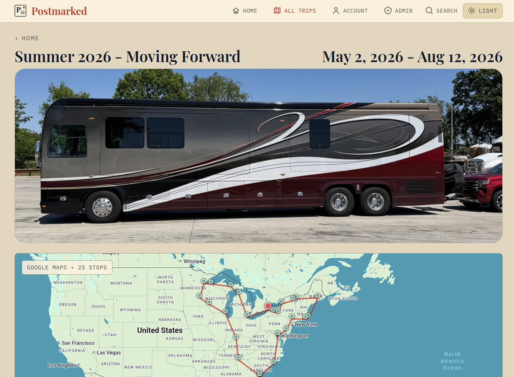
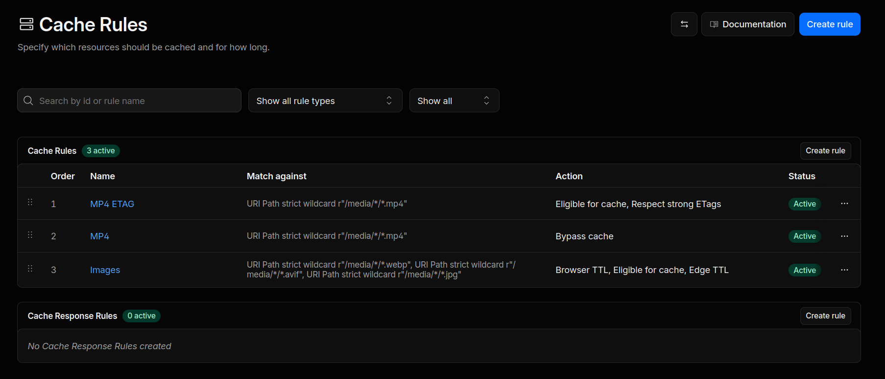

# Postmarked

Postmarked is a self-hosted digital postcard app. Replace the social media feed with a private, lightweight way to share travel photos, videos, and updates with family and friends. It works for road trips, long weekends, international travel, full-time travel, or any journey worth remembering.

Postmarked is intentionally simple: run it, sign in, create a trip, post updates along the way, and let people follow along.

## Features

- Trip pages, timeline, posts, photos, and videos.
- Public/private visibility controls.
- Subscriber email notifications for new posts.
- Admin UI for trips, stops, posts, media, users, site text, and settings.
- Customizable home page and section text via admin.
- Backup and instance migration.
- RV Trip Wizard `.xlsx` import for RV travelers.
- Optional privacy policy and terms pages via Markdown files.
- Docker deployment.

## Screenshot



## Install

Download the two files you need:

```bash
curl -fLO https://raw.githubusercontent.com/Backroads4Me/postmarked/main/compose.yaml
curl -fLo .env https://raw.githubusercontent.com/Backroads4Me/postmarked/main/.env.example
```

Edit `.env` and set production values for:

- `SECRET_KEY`
- `APP_BASE_URL`
- `ADMIN_EMAIL`
- `ADMIN_PASSWORD`
- `POSTGRES_PASSWORD`

Then start the stack:

```bash
docker compose up -d
```

Open the admin UI:

```text
http://localhost:4321/admin
```

Sign in with `ADMIN_EMAIL` and `ADMIN_PASSWORD` from `.env`.

## Storage

```env
MEDIA_DIR=./data
```

| Subdirectory  | Contents                                                  | Back up?           |
| ------------- | --------------------------------------------------------- | ------------------ |
| `derivatives` | Processed media served to the site                        | **Yes**            |
| `backups`     | Scheduled/on-demand `pg_dump` database dumps              | **Yes**            |
| `originals`   | Source uploads (empty unless `MEDIA_KEEP_ORIGINALS=true`) | Optional           |
| `ingest`      | Transient processing input                                | No                 |
| `db_data`     | **Live** PostgreSQL data directory                        | **No** — see below |

For disaster recovery, copy `derivatives` and `backups` (and `originals` if you
keep them). **Do not** file-copy the live `db_data` directory — it is mid-write
and would produce a corrupt snapshot; the database is captured consistently by
the `pg_dump` files in `backups` instead.

<details>
<summary><strong>Serving Behind Cloudflare</strong></summary>

If you proxy Postmarked through Cloudflare, videos may fail to
play on iOS/Safari while working fine on desktop. To prevent this, you must add these **Cache Rules** in the Cloudflare dashboard (Caching → Cache Rules), in this order:

1. **MP4 ETAG** — Match `URI Path` wildcard `/media/*/*.mp4`; set
   _Eligible for cache_ and enable _Respect strong ETags_.
2. **MP4** — Match `URI Path` wildcard `/media/*/*.mp4`; set _Bypass cache_.
3. **Images** — Match `URI Path` wildcards `/media/*/*.webp`, `/media/*/*.avif`,
   and `/media/*/*.jpg`; set _Eligible for cache_ with Browser TTL and Edge TTL
   both set to _Respect origin_.

Rules 1 and 2 must stay in this order. Rule 1 preserves the strong ETags Safari
needs for range requests; rule 2 bypasses the shared cache so range requests
reach the origin. Rule 3 caches images at the edge using the one-year
`immutable` headers Postmarked sends for processed derivatives.

After adding the rules, purge any already-cached MP4s (Caching → Purge) so
stale responses are evicted.

See Cloudflare's guide: <https://developers.cloudflare.com/cache/troubleshooting/mp4-videos-on-ios-and-safari/>



</details>

## Backup And Restore

In the admin UI, use Backup to export or restore an instance. This is a
**convenience tool** designed to backup small sites or to migrate a dev site to prod, not a true disaster-recovery system for a mature site (see below).

- **Export** downloads a single ZIP containing all data and processed media derivatives. Original uploads are intentionally not included; derivatives are sufficient to serve the site.
- **Restore** uploads a ZIP and **replaces** the current instance with its
  contents. It replaces all data and media. Restore is destructive and has no preview step.
- **Media size grows quickly.** The export ZIP embeds **ALL** processed media
  derivatives, so it becomes impractically large as content accumulates. Export/Import
  is best for initial setup, moving from dev to production, or restoring a small early
  instance — not as a routine backup strategy for a mature library.

### Disaster Recovery Backup

For routine **disaster recovery**, the app writes a database dump to `${MEDIA_DIR}/backups` automatically:

- A daily snapshot runs at `BACKUP_HOUR`:`BACKUP_MINUTE`
  (server timezone), keeping the most recent `BACKUP_RETENTION` dumps.
- The admin Backup page has a **Snapshot Database Now** button to trigger one
  on demand.
- These dumps are **DB-only**; pair them with a file-level copy of `derivatives`
  (e.g. `rsync`/`restic`/`borg` to external storage) for a complete recovery
  set.

## RV Trip Wizard Import

In the admin UI, use the Import page to upload an RV Trip Wizard `.xlsx` export. Review the preview diff, then apply it.

Imported stops are created as private drafts.

<details>
<summary><strong>Privacy Policy &amp; Terms of Service Pages</strong></summary>

Postmarked ships built-in privacy and terms pages at `/privacy` and `/terms`. By default they show generic placeholder content. To customize them, place `privacy.md` and/or `terms.md` in your `MEDIA_DIR` on the host. They are picked up automatically — no extra configuration needed.

See `privacy.md.example` and `terms.md.example` in the repo root for templates.

To include a support contact email in the default built-in pages:

```env
SUPPORT_EMAIL=support@example.com
```

If unset, the contact section reads "contact the site administrator."

</details>

## License

[GPL v3](LICENSE)

## Support

Postmarked is free and open source.

If it helped you share your travels, please star the repository so other self-hosters can find it.

[](https://github.com/Backroads4Me/postmarked)
[](https://github.com/sponsors/Backroads4Me)
