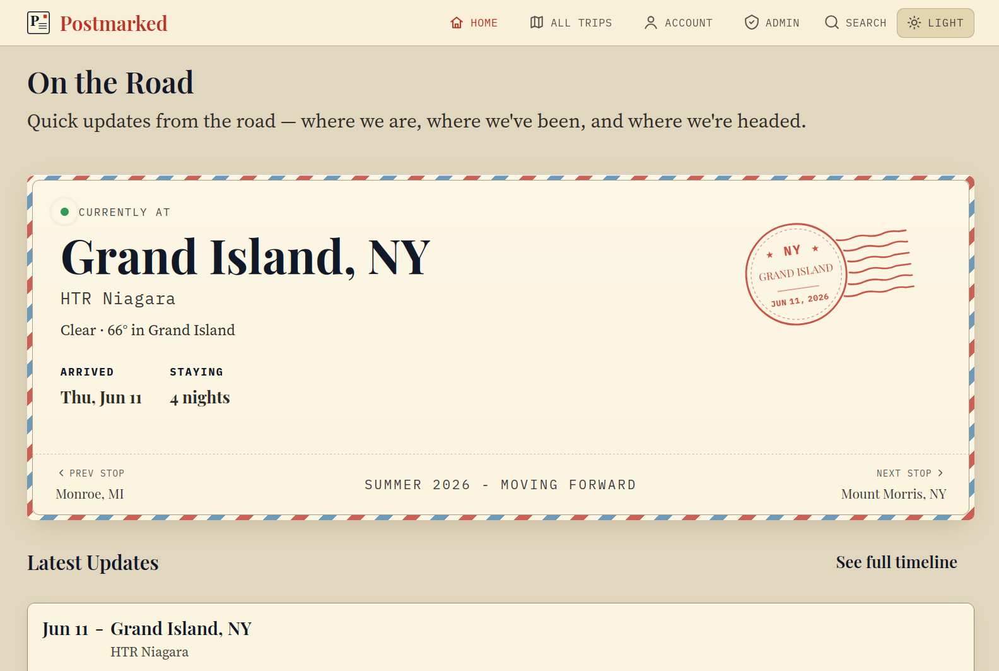

# Postmarked

Postmarked is a self-hosted digital postcard app. Replace the social media feed with a private, lightweight way to share travel photos, videos, and updates with family and friends. It works for road trips, long weekends, international travel, full-time travel, or any journey worth remembering.

Postmarked is intentionally simple: run it, sign in, create a trip, post updates along the way, and let people follow along.

## Features

- Trip pages, timeline, posts, photos, and videos.
- Public/private visibility controls.
- Subscriber email notifications for new posts.
- Admin UI for trips, stops, posts, media, users, site text, and settings.
- Customizable home page and section text via admin.
- Backup and instance migration.
- RV Trip Wizard `.xlsx` import for RV travelers.
- Optional privacy policy and terms pages via Markdown files.
- Docker deployment.

## Screenshots



[Trip page](screenshots/trip.png) · [Gallery](screenshots/gallery.png) · [Post editor](screenshots/post-editor.png)

## Install

Download the two files you need:

```bash
curl -fLO https://raw.githubusercontent.com/Backroads4Me/postmarked/main/compose.yaml
curl -fLo .env https://raw.githubusercontent.com/Backroads4Me/postmarked/main/.env.example
```

Edit `.env` and set production values for:

- `SECRET_KEY`
- `APP_BASE_URL`
- `ADMIN_EMAIL`
- `ADMIN_PASSWORD`
- `POSTGRES_PASSWORD`

Then start the stack:

```bash
docker compose up -d
```

Open the admin UI:

```text
http://localhost:4321/admin
```

Sign in with `ADMIN_EMAIL` and `ADMIN_PASSWORD` from `.env`.

## Storage

```env
MEDIA_DIR=./data
MAX_UPLOAD_FILE_MIB=500
```

`MAX_UPLOAD_FILE_MIB` is the per-file media upload limit, measured in MiB.
The default is 500 MiB, which supports typical phone photos and short videos
while still bounding disk and processing cost. Raise it for longer or 4K video
uploads.

| Subdirectory  | Contents                                                  | Back up?           |
| ------------- | --------------------------------------------------------- | ------------------ |
| `derivatives` | Processed media served to the site                        | **Yes**            |
| `backups`     | Scheduled/on-demand `pg_dump` database dumps              | **Yes**            |
| `originals`   | Source uploads (empty unless `MEDIA_KEEP_ORIGINALS=true`) | Optional           |
| `ingest`      | Transient processing input                                | No                 |
| `db_data`     | **Live** PostgreSQL data directory                        | **No** — see below |

For disaster recovery, copy `derivatives` and `backups` (and `originals` if you
keep them). **Do not** file-copy the live `db_data` directory — it is mid-write
and would produce a corrupt snapshot; the database is captured consistently by
the `pg_dump` files in `backups` instead.

<details>
<summary><strong>Serving Behind Cloudflare</strong></summary>

If you proxy Postmarked through Cloudflare, add these three **Cache Rules**
(Caching → Cache Rules → Create rule). For each one, click **Edit expression**
and paste the expression below verbatim, then set the listed cache options.
Keep them in this order.

**1. MP4** — bypass the edge cache so iOS/Safari range requests reach the origin
(otherwise videos fail to play on iPhone while working on desktop).

```
(http.request.uri.path strict wildcard r"/media/*/*.mp4")
```

- Cache eligibility: **Bypass cache**

**2. Images** — cache processed image derivatives at the edge (Postmarked serves
them with one-year `immutable` headers).

```
(http.request.uri.path strict wildcard r"/media/*/*.webp") or (http.request.uri.path strict wildcard r"/media/*/*.avif") or (http.request.uri.path strict wildcard r"/media/*/*.jpg")
```

- Cache eligibility: **Eligible for cache**
- Edge TTL: **Respect origin TTL**
- Browser TTL: **Respect origin TTL**

**3. Cache home + timeline** — edge-cache the two server-rendered pages for
anonymous visitors so concurrent traffic is absorbed by the CDN instead of
re-rendering at the origin. Authenticated admins (who carry the
`postmarked_session` cookie) bypass the cache and always hit the origin.

```
(http.request.uri.path eq "/" or http.request.uri.path eq "/timeline") and not http.cookie contains "postmarked_session"
```

- Cache eligibility: **Eligible for cache**
- Edge TTL: **Respect origin TTL**
- Browser TTL: **Respect origin TTL**

Rule 3 relies on the `Cache-Control: public, max-age=30, stale-while-revalidate=300`
header Postmarked sends for these pages, so **Respect origin TTL** gives a 30s
freshness window with background revalidation — new posts appear within ~30s.
If your zone serves more than one hostname and you want the rule scoped to one,
prepend `http.host eq "yourdomain.tld" and ` to the expression.

After adding the rules, purge any already-cached MP4s (Caching → Purge) so
stale responses are evicted.

See Cloudflare's guide: <https://developers.cloudflare.com/cache/troubleshooting/mp4-videos-on-ios-and-safari/>

Verify each rule with `curl -sI https://yourdomain.tld/ | grep -i cf-cache-status`
(run twice — the second request should report `HIT`).

</details>

## Backup And Restore

In the admin UI, use Backup to export or restore an instance. This is a
**convenience tool** designed to backup small sites or to migrate a dev site to prod, not a true disaster-recovery system for a mature site (see below).

- **Export** downloads a single ZIP containing all data and processed media derivatives. Original uploads are intentionally not included; derivatives are sufficient to serve the site.
- **Restore** uploads a ZIP and **replaces** the current instance with its
  contents. It replaces all data and media. Restore is destructive and has no preview step.
- **Media size grows quickly.** The export ZIP embeds **ALL** processed media
  derivatives, so it becomes impractically large as content accumulates. Export/Import
  is best for initial setup, moving from dev to production, or restoring a small early
  instance — not as a routine backup strategy for a mature library.

### Disaster Recovery Backup

For routine **disaster recovery**, the app writes a database dump to `${MEDIA_DIR}/backups` automatically:

- A daily snapshot runs at `BACKUP_HOUR`:`BACKUP_MINUTE`
  (server timezone), keeping the most recent `BACKUP_RETENTION` dumps.
- The admin Backup page has a **Snapshot Database Now** button to trigger one
  on demand.
- These dumps are **DB-only**; pair them with a file-level copy of `derivatives`
  (e.g. `rsync`/`restic`/`borg` to external storage) for a complete recovery
  set.

## RV Trip Wizard Import

In the admin UI, use the Import page to upload an RV Trip Wizard `.xlsx` export. Review the preview diff, then apply it.

Imported stops are created as private drafts.

<details>
<summary><strong>Privacy Policy &amp; Terms of Service Pages</strong></summary>

Postmarked ships built-in privacy and terms pages at `/privacy` and `/terms`. By default they show generic placeholder content. To customize them, place `privacy.md` and/or `terms.md` in your `MEDIA_DIR` on the host. They are picked up automatically — no extra configuration needed.

See `privacy.md.example` and `terms.md.example` in the repo root for templates.

To include a support contact email in the default built-in pages:

```env
SUPPORT_EMAIL=support@example.com
```

If unset, the contact section reads "contact the site administrator."

</details>

## License

[AGPL v3](LICENSE)

## Support

Postmarked is free and open source.

If it helped you share your travels, please star the repository so other self-hosters can find it.

[](https://github.com/Backroads4Me/postmarked)
[](https://github.com/sponsors/Backroads4Me)
