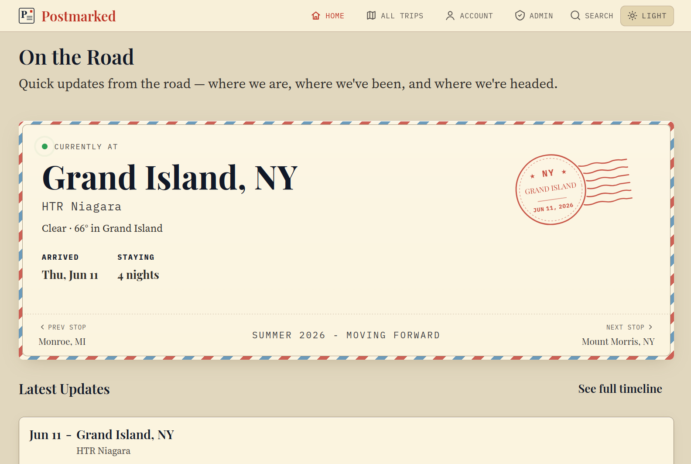

# Postmarked

**Replace the social media feed with private, self-hosted digital postcards for
the people you actually want to keep in the loop.**

[Website](https://postmarked.io/) · [Install](#install) ·
[Operations guide](docs/operations.md) ·
[Configuration guide](docs/configuration.md) ·
[Report a problem](https://github.com/Backroads4Me/postmarked/issues/new) ·
[Contribute](#contributing)

Postmarked is a lightweight travel journal for sharing photos, videos, stops,
and updates with family and friends. It works for road trips, long weekends,
international travel, full-time travel, and any journey worth remembering.



## Why Postmarked?

- **Your trip, not an algorithm.** Visitors follow a chronological story
  instead of a social feed designed to hold their attention.
- **Public or private sharing.** Choose who can see each trip and let
  subscribers receive email notifications when you post.
- **Simple publishing.** Sign in, create a trip, add stops and updates, and let
  people follow along.
- **Self-hosted and portable.** Run Postmarked with Docker, keep control of the
  data, and use the built-in export, restore, and migration tools.

Postmarked also includes photo and video galleries, current-stop weather,
customizable site text, user approval controls, optional single sign-on, and
RV Trip Wizard import.

## Screenshots

[Trip page](screenshots/trip.png) · [Gallery](screenshots/gallery.png) ·
[Post editor](screenshots/post-editor.png)

## Install

Postmarked requires Docker with Compose. Download the Compose file and example
environment:

```bash
curl -fLO https://raw.githubusercontent.com/Backroads4Me/postmarked/main/compose.yaml
curl -fLo .env https://raw.githubusercontent.com/Backroads4Me/postmarked/main/.env.example
```

Edit `.env` and set production values for `SECRET_KEY`, `APP_BASE_URL`,
`ADMIN_EMAIL`, `ADMIN_PASSWORD`, and `POSTGRES_PASSWORD`. Then start the stack:

```bash
docker compose up -d
```

Open `http://localhost:4321/admin` and sign in with the admin email and password
from `.env`.

## Documentation

- The [operations guide](docs/operations.md) covers storage, backups, restore,
  upgrades, and Cloudflare cache rules.
- The [configuration guide](docs/configuration.md) covers RV Trip Wizard
  import, OpenID Connect, Google sign-in, and policy pages.
- [`.env.example`](.env.example) documents the available deployment settings.

## Contributing

Bug reports, feature ideas, and pull requests are welcome. Use
[GitHub Issues](https://github.com/Backroads4Me/postmarked/issues) to describe a
problem or proposed behavior before starting a substantial change.

## License

Postmarked is licensed under the [GNU Affero General Public License v3](LICENSE).

## Support the project

Postmarked is free and open source. If it helps you share your travels,
starring the repository helps other self-hosters find it.

[](https://github.com/Backroads4Me/postmarked)
[](https://github.com/sponsors/Backroads4Me)
